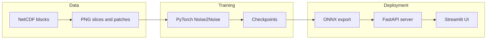

# Medical Image Enhancement System

Real-time **CT scan denoising** using a **Noise2Noise** U-Net: train in PyTorch and deploy via ONNX Runtime with a FastAPI inference server and a Streamlit studio UI.

- **Python**: 3.14+ ([`requires-python` in `pyproject.toml`])
- **Core stack**: PyTorch · ONNX Runtime (GPU) · FastAPI · Streamlit
- **License**: MIT (see [License](#license))

---

## What this repo contains

- **Noise2Noise training** on noisy image pairs (no clean ground truth required).
- **Dataset pipeline** from NetCDF blocks (`.nc`) to PNG slices/patches.
- **Deployment-ready inference** using ONNX Runtime:
  - GPU tiled inference (fast for large images)
  - CPU inference with padding/wrapping for arbitrary sizes
- **FastAPI backend** with hot-swappable inference configuration.
- **Streamlit UI** (“Medical Denoiser Studio”) for interactive inspection and batch processing.



---

## Quick start

### Option A: Docker (recommended for UI + inference)

This repo ships a GPU-ready compose setup: FastAPI on port **8000** and Streamlit on port **8501**.

```powershell
docker compose up --build
```

- Backend API: `http://localhost:8000`
- Streamlit UI: `http://localhost:8501`

Notes:
- The compose file reserves an NVIDIA GPU for the backend (`docker-compose.yaml`).
- The Streamlit container is configured with `API_URL=http://backend:8000`.

### Option B: Local (run API + UI without training)

Install dependencies via `uv`, then start the API and UI in separate terminals.

```powershell
uv sync
uv run uvicorn api.api_server:app --host 0.0.0.0 --port 8000
```

```powershell
uv run streamlit run app/main.py
```

The Streamlit app calls the backend using `API_URL` (defaults to `http://127.0.0.1:8000` in `app/utils/api_client.py`).

---

## Screenshots (coming soon)

Planned screenshots for the landing page:
- Image Inspector: before/after comparison and error heatmap
- Batch Processor: multi-file denoise + ZIP download
- Sidebar controls: model selection, CUDA toggle, wrapped-model toggle, unload VRAM

---

## Prerequisites

- **Python** 3.14+
- **uv** package manager (recommended; used by this repo)
- **CUDA-capable GPU** recommended for training and real-time ONNX inference
- **Docker + NVIDIA Container Toolkit** (if using the Docker quick start)
- **Training data** (for training only): NetCDF tomography blocks placed under `data/raw/` (gitignored)

---

## Installation

```powershell
git clone https://github.com/GregOratOr/medical-image-enhancement-system.git
cd medical-image-enhancement-system
uv sync
```

Optional docs dependencies:

```powershell
uv sync --group dev
```

Environment:
- `PYTHONPATH=.` is set in `.env` for local development.

---

## Usage

### A. Streamlit UI: Medical Denoiser Studio

Run the UI:

```powershell
uv run streamlit run app/main.py
```

Pages are registered in `app/routes.py`:
- Dashboard
- Image Inspector
- Batch Processor

### B. REST API (FastAPI)

Run the server:

```powershell
uv run uvicorn api.api_server:app --host 0.0.0.0 --port 8000
```

Endpoints (implemented in `api/api_server.py`):

| Method | Path | Description |
|--------|------|-------------|
| GET | `/` | Health check + active inference configuration |
| POST | `/predict` | Upload an image → returns denoised PNG bytes |
| POST | `/set_config` | Hot-swap model name / CUDA / wrapped mode |
| POST | `/error_map` | Upload two images → returns difference heatmap |
| POST | `/unload` | Unload model to free memory / VRAM |

Minimal `/predict` example:

```powershell
curl -X POST "http://127.0.0.1:8000/predict" `
  -F "file=@path\to\scan.png" `
  -o denoised.png
```

### C. Full training pipeline

1) Prepare dataset (NetCDF → PNG slices and optional patches):

```powershell
uv run python src/datasets/make_dataset.py
```

2) Train (Noise2Noise U-Net). Configuration is driven by Draccus + YAML:

```powershell
uv run python scripts/train.py --config_path configs/train.yaml
```

3) Export ONNX (checkpoint → `onnx/models/*.onnx`):

```powershell
uv run python onnx/export_onnx.py
```

Note: `onnx/export_onnx.py` currently points at a sample checkpoint path in its `__main__` block; you will likely edit that path to your run’s checkpoint.

4) Batch ONNX inference (directory processing):

```powershell
uv run python onnx/onnx_inference.py
```

The default `__main__` config in `onnx/onnx_inference.py` uses:
- `INPUT_DIR = "data/processed/test/sample_images"`
- `OUTPUT_DIR = "inferences/onnx/outputs_GPU"` (when CUDA enabled)

### D. PyTorch inference (without ONNX)

```powershell
uv run python scripts/inference.py --config_path configs/inference.yaml
uv run python scripts/simulate_inference.py --config_path configs/sim_inference.yaml
```

---

## Bundled ONNX models

This repo includes pre-exported models under `onnx/models/`:

- `medical_denoiser_dyno.onnx`: standard model (default in `api/api_server.py`)
- `medical_denoiser_dyno_wrap.onnx`: wrapped model for handling arbitrary input sizes (useful for CPU inference)

You can toggle the active model / CUDA / wrapped mode via:
- the Streamlit sidebar, or
- `POST /set_config` on the API.

When selecting the wrapped model, the UI sends `model_name="medical_denoiser_dyno_wrap"` and `wrapped_model=true` (see `app/components/sidebar.py` and `api/api_server.py`).

---

## Configuration

### YAML configs

Configs live under `configs/`:
- `train.yaml`: training defaults (data paths, noise params, model settings, logging)
- `inference.yaml`: PyTorch inference configuration
- `sim_inference.yaml`: inference with synthetic noise simulation

### Environment variables

| Variable | Default | Purpose |
|----------|---------|---------|
| `PYTHONPATH` | `.` | Enables root imports for scripts |
| `API_URL` | `http://127.0.0.1:8000` | Streamlit → FastAPI base URL (`app/utils/api_client.py`) |
| `CLOUD_DEPLOYMENT` | unset (true in Docker) | UI behavior toggle for batch workflows |

### Noise types (training)

Noise modules are registered in `src/transforms/noise.py`. Examples include:
`gaussian`, `poisson`, `spec_poisson`, `spec_gaussian_blur`, `spec_bernoulli`, `spec_drop`, `spec_gaussian_noise`.

---

## Project structure

```
api/          FastAPI inference server
app/          Streamlit UI
configs/      YAML + dataclass configs
onnx/         Export, GPU/CPU inference backends, bundled ONNX models
scripts/      Training and PyTorch inference entry points
src/          Models, datasets, trainers, transforms, utilities
docs/         MkDocs documentation site
docker/       CUDA serving Dockerfile
```

---

## Documentation

The project documentation is built with MkDocs Material.

Local docs server:

```powershell
uv sync --group dev
uv run mkdocs serve
```

Start here: `docs/index.md`. Some user-guide/tutorial pages referenced by `mkdocs.yml` are currently stubs; the API reference pages are the most complete.

---

## Development & testing

This repo does not currently include a `pytest` test suite. The `tests/` directory contains manual/visual scripts (e.g., noise generation and loader sanity checks) intended for interactive validation.

---

## License

MIT License — see `LICENSE`.

Note: if the `LICENSE` file is not present yet, add it before publishing the repo as MIT-licensed.

---

## Acknowledgments

- Noise2Noise: *Learning Image Restoration without Clean Data* (`https://arxiv.org/abs/1801.02679`)
- PyTorch, ONNX Runtime, FastAPI, Streamlit