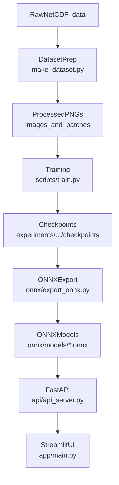

# Overview

The Medical Image Enhancement System is a **CT scan denoising** pipeline designed for both research (training/experiments) and deployment (real-time inference).

It combines:

- **Noise2Noise training** in PyTorch (learns from *noisy-noisy* pairs, without clean targets)
- **ONNX Runtime inference** for fast deployment (GPU tiling or CPU padding)
- **FastAPI backend** exposing a small inference API
- **Streamlit UI** (“Medical Denoiser Studio”) for interactive inspection and batch processing

---

## How the system fits together

---

## Primary entry points

- **Web UI**: `uv run streamlit run app/main.py`
- **API server**: `uv run uvicorn api.api_server:app --port 8000`
- **Training**: `uv run python scripts/train.py --config_path configs/train.yaml`
- **Dataset preparation**: `uv run python src/datasets/make_dataset.py`
- **ONNX export**: `uv run python onnx/export_onnx.py`

---

## Where to go next

- Installation: `user_guide/installation.md`
- Real-time inference: `user_guide/deployment/real_time.md`
- Docker deployment: `user_guide/deployment/docker.md`
- Tutorials:
  - `tutorials/training.md`
  - `tutorials/evaluation.md`